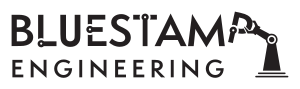

# Robotic Arm 
The Robotic arm is three jointed with 4 servos attached one for each different movment. There is one to control the claw, another two for moving the arm up and down, and finally one on the bottom to make it move left and right. Some of the biggest takeaways from completing the project is how engineering can really create beautiful masterpieces that could do anything. 

You should comment out all portions of your portfolio that you have not completed yet, as well as any instructions:
```HTML 
<!--- This is an HTML comment in Markdown -->
<!--- Anything between these symbols will not render on the published site -->
```

| **Engineer** | **School** | **Area of Interest** | **Grade** |
|:--:|:--:|:--:|:--:|
| Neil S | Ridge High School | Electrical Engineering/Mechanical Engineering | Incoming Freshman

**Replace the BlueStamp logo below with an image of yourself and your completed project. Follow the guide [here](https://tomcam.github.io/least-github-pages/adding-images-github-pages-site.html) if you need help.**


  
# Final Milestone

<iframe width="560" height="315" src="https://www.youtube.com/embed/u6Igeg511Dw?si=elcVBavjxIRtu_eb" title="YouTube video player" frameborder="0" allow="accelerometer; autoplay; clipboard-write; encrypted-media; gyroscope; picture-in-picture; web-share" referrerpolicy="strict-origin-when-cross-origin" allowfullscreen></iframe>


I finished the enitre project from my last milestone. Finally finishing up the coding as well as finishing up the wiring as well. 
After Blue Stamp I wish I could learn even more about electrical engineering as well as computer science. 


# Second Milestone

<iframe width="560" height="315" src="https://www.youtube.com/embed/aUVuZlYsD_w?si=PSsywKs5papU_18r" title="YouTube video player" frameborder="0" allow="accelerometer; autoplay; clipboard-write; encrypted-media; gyroscope; picture-in-picture; web-share" referrerpolicy="strict-origin-when-cross-origin" allowfullscreen></iframe>


After last week I was able to finish building my full project and finish wiring as well. I also changed the base for the arduino and wiring to fit the 9 volt battery power supply. 

# First Milestone

<iframe width="560" height="315" src="https://www.youtube.com/embed/K4CfUOkUoq8?si=UBNTZKnVf3MclWs3" title="YouTube video player" frameborder="0" allow="accelerometer; autoplay; clipboard-write; encrypted-media; gyroscope; picture-in-picture; web-share" referrerpolicy="strict-origin-when-cross-origin" allowfullscreen></iframe>


My project is the robotic arm and the way I have been planing out the project is to split it up into three seperate portions for each week. 1st week is for building the project and the 2nd is for wiring and finsihing up building and finally for the third week is for coding and if time permits modifications as well. 

# Schematics 
https://cdn.discordapp.com/attachments/1391553011389698112/1398309957740531843/schematicreal.png?ex=6884e521&is=688393a1&hm=000c58390870b21b4bdb518f93fa0c63ca6454e26981e6a599400e7c67ab44c7

# Code
Here's where you'll put your code. The syntax below places it into a block of code. Follow the guide [here]([url](https://www.markdownguide.org/extended-syntax/)) to learn how to customize it to your project needs. 

```c++
#include "src/CokoinoArm.h"

CokoinoArm arm;
int verL,horL,verR,horR;

void turnUD(void){ //detects vertical axis of left stick and determines how to move arm up and down
  if(!(verL > 450 && verL < 560)){ //controller deadzone 
    if(0<=verL && verL<=100){arm.up(10);return;}
    if(900<verL && verL<=1024){arm.down(10);return;} 
    if(100<verL && verL<=200){arm.up(20);return;}
    if(800<verL && verL<=900){arm.down(20);return;}
    if(200<verL && verL<=300){arm.up(25);return;}
    if(700<verL && verL<=800){arm.down(25);return;}
    if(300<verL && verL<=400){arm.up(30);return;}
    if(600<verL && verL<=700){arm.down(30);return;}
    if(400<verL && verL<=480){arm.up(35);return;}
    if(540<verL && verL<=600){arm.down(35);return;} 
    }
}

void turnLR(void){ //detects horizontal axis of left stick and determines how to move arm left and right
  if(!(horL > 450 && horL < 560)){ //controller deadzone 
    if(0<=horL && horL<=100){arm.right(0);return;}
    if(900<horL && horL<=1024){arm.left(0);return;}  
    if(100<horL && horL<=200){arm.right(5);return;}
    if(800<horL && horL<=900){arm.left(5);return;}
    if(200<horL && horL<=300){arm.right(10);return;}
    if(700<horL && horL<=800){arm.left(10);return;}
    if(300<horL && horL<=400){arm.right(15);return;}
    if(600<horL && horL<=700){arm.left(15);return;}
    if(400<horL && horL<=480){arm.right(20);return;}
    if(540<horL && horL<=600){arm.left(20);return;}
  }
}
void turnCO(void){ //detects vertical axis of right stick and determines how to open and close claw
  if(!(verR > 450 && verR < 560)){ //controller deadzone 
    if(0<=verR && verR<=100){arm.close(0);return;}
    if(900<verR && verR<=1024){arm.open(0);return;} 
    if(100<verR && verR<=200){arm.close(5);return;}
    if(800<verR && verR<=900){arm.open(5);return;}
    if(200<verR && verR<=300){arm.close(10);return;}
    if(700<verR && verR<=800){arm.open(10);return;}
    if(300<verR && verR<=400){arm.close(15);return;}
    if(600<verR && verR<=700){arm.open(15);return;}
    if(400<verR && verR<=480){arm.close(20);return;}
    if(540<verR && verR<=600){arm.open(20);return;} 
    }
}

//ensure only 1 command is read at a time 
void date_processing(int *x,int *y){
  if(abs(512-*x)>abs(512-*y))
    {*y = 512;}
  else
    {*x = 512;}
}

void setup() {
  Serial.begin(9600);
  //arm of servo motor connection pins
  arm.ServoAttach(4,5,6,7);
  //arm of joy stick connection pins : verL,horL,verR,horR
  arm.JoyStickAttach(A0,A1,A2,A3);
}

void loop() {
  // read 4 stick values
  verL = arm.JoyStickL.read_y();  // Vertical left stick
  horL = arm.JoyStickL.read_x();  // Horizontal left stick
  verR = arm.JoyStickR.read_y();  // Vertical right stick (for claw)
  horR = arm.JoyStickR.read_x();  // Horizontal right stick (unused in your functions)

  // Process left stick to ensure only one command at a time
  int verL_processed = verL;
  int horL_processed = horL;
  date_processing(&verL,&horL);
  

  // determine movement
  turnUD();  // handle up/down movement
  turnLR();  // handle left/right movement
  turnCO();  // handle claw open/close
  
  // Small delay to prevent overwhelming the system
  delay(20);
}
```

# Bill of Materials
Here's where you'll list the parts in your project. To add more rows, just copy and paste the example rows below.
Don't forget to place the link of where to buy each component inside the quotation marks in the corresponding row after href =. Follow the guide [here]([url](https://www.markdownguide.org/extended-syntax/)) to learn how to customize this to your project needs. 

| **Part** | **Note** | **Price** | **Link** |
|:--:|:--:|:--:|:--:|
| Item Name | What the item is used for | $Price | <a href="https://www.amazon.com/Arduino-A000066-ARDUINO-UNO-R3/dp/B008GRTSV6/"> Link </a> |
| Item Name | What the item is used for | $Price | <a href="https://www.amazon.com/Arduino-A000066-ARDUINO-UNO-R3/dp/B008GRTSV6/"> Link </a> |
| Item Name | What the item is used for | $Price | <a href="https://www.amazon.com/Arduino-A000066-ARDUINO-UNO-R3/dp/B008GRTSV6/"> Link </a> |

# Other Resources/Examples
One of the best parts about Github is that you can view how other people set up their own work. Here are some past BSE portfolios that are awesome examples. You can view how they set up their portfolio, and you can view their index.md files to understand how they implemented different portfolio components.
- [Example 1](https://trashytuber.github.io/YimingJiaBlueStamp/)
- [Example 2](https://sviatil0.github.io/Sviatoslav_BSE/)
- [Example 3](https://arneshkumar.github.io/arneshbluestamp/)

