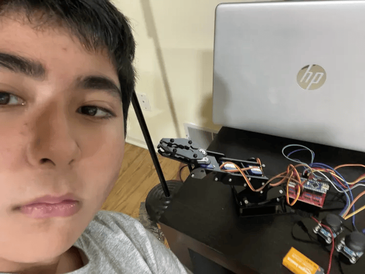
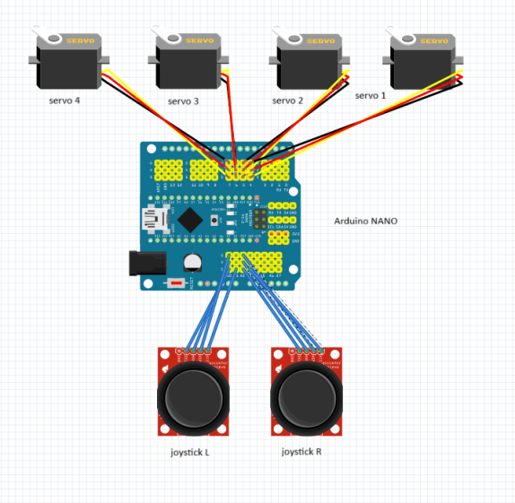

# Robotic Arm 
The Robotic arm is three jointed with 4 servos attached one for each different movment. There is one to control the claw, another two for moving the arm up and down, and finally one on the bottom to make it move left and right. Some of the biggest takeaways from completing the project is how engineering can really create beautiful masterpieces that could do anything. 


| **Engineer** | **School** | **Area of Interest** | **Grade** |
|:--:|:--:|:--:|:--:|
| Neil S | Ridge High School | Electrical Engineering/Mechanical Engineering | Incoming Freshman



  
# Final Milestone

<iframe width="560" height="315" src="https://www.youtube.com/embed/u6Igeg511Dw?si=elcVBavjxIRtu_eb" title="YouTube video player" frameborder="0" allow="accelerometer; autoplay; clipboard-write; encrypted-media; gyroscope; picture-in-picture; web-share" referrerpolicy="strict-origin-when-cross-origin" allowfullscreen></iframe>


I finished the enitre project from my last milestone. I finished the coding in the arduino with help from my instructor Josh.  
For after Blue Stamp I wish I could learn even more about electrical engineering as well as computer science because I belive I found an passion in futher pursuing my goals of mechanical and electrical engineering.  


# Second Milestone

<iframe width="560" height="315" src="https://www.youtube.com/embed/aUVuZlYsD_w?si=PSsywKs5papU_18r" title="YouTube video player" frameborder="0" allow="accelerometer; autoplay; clipboard-write; encrypted-media; gyroscope; picture-in-picture; web-share" referrerpolicy="strict-origin-when-cross-origin" allowfullscreen></iframe>


After last week I was able to finish building my full project and finish wiring as well. I also changed the base for the arduino and wiring to fit the 9 volt battery power supply. 

# First Milestone

<iframe width="560" height="315" src="https://www.youtube.com/embed/K4CfUOkUoq8?si=UBNTZKnVf3MclWs3" title="YouTube video player" frameborder="0" allow="accelerometer; autoplay; clipboard-write; encrypted-media; gyroscope; picture-in-picture; web-share" referrerpolicy="strict-origin-when-cross-origin" allowfullscreen></iframe>


My project is the robotic arm and the way I have been planing out the project is to split it up into three seperate portions for each week. 1st week is for building the project and the 2nd is for wiring and finsihing up building and finally for the third week is for coding and if time permits modifications as well. 

# Schematics 


# Code


```c++
#include "src/CokoinoArm.h"

CokoinoArm arm;
int verL,horL,verR,horR;

void turnUD(void){ //detects vertical axis of left stick and determines how to move arm up and down
  if(!(verL > 450 && verL < 560)){ //controller deadzone 
    if(0<=verL && verL<=100){arm.up(10);return;}
    if(900<verL && verL<=1024){arm.down(10);return;} 
    if(100<verL && verL<=200){arm.up(20);return;}
    if(800<verL && verL<=900){arm.down(20);return;}
    if(200<verL && verL<=300){arm.up(25);return;}
    if(700<verL && verL<=800){arm.down(25);return;}
    if(300<verL && verL<=400){arm.up(30);return;}
    if(600<verL && verL<=700){arm.down(30);return;}
    if(400<verL && verL<=480){arm.up(35);return;}
    if(540<verL && verL<=600){arm.down(35);return;} 
    }
}

void turnLR(void){ //detects horizontal axis of left stick and determines how to move arm left and right
  if(!(horL > 450 && horL < 560)){ //controller deadzone 
    if(0<=horL && horL<=100){arm.right(0);return;}
    if(900<horL && horL<=1024){arm.left(0);return;}  
    if(100<horL && horL<=200){arm.right(5);return;}
    if(800<horL && horL<=900){arm.left(5);return;}
    if(200<horL && horL<=300){arm.right(10);return;}
    if(700<horL && horL<=800){arm.left(10);return;}
    if(300<horL && horL<=400){arm.right(15);return;}
    if(600<horL && horL<=700){arm.left(15);return;}
    if(400<horL && horL<=480){arm.right(20);return;}
    if(540<horL && horL<=600){arm.left(20);return;}
  }
}
void turnCO(void){ //detects vertical axis of right stick and determines how to open and close claw
  if(!(verR > 450 && verR < 560)){ //controller deadzone 
    if(0<=verR && verR<=100){arm.close(0);return;}
    if(900<verR && verR<=1024){arm.open(0);return;} 
    if(100<verR && verR<=200){arm.close(5);return;}
    if(800<verR && verR<=900){arm.open(5);return;}
    if(200<verR && verR<=300){arm.close(10);return;}
    if(700<verR && verR<=800){arm.open(10);return;}
    if(300<verR && verR<=400){arm.close(15);return;}
    if(600<verR && verR<=700){arm.open(15);return;}
    if(400<verR && verR<=480){arm.close(20);return;}
    if(540<verR && verR<=600){arm.open(20);return;} 
    }
}

//ensure only 1 command is read at a time 
void date_processing(int *x,int *y){
  if(abs(512-*x)>abs(512-*y))
    {*y = 512;}
  else
    {*x = 512;}
}

void setup() {
  Serial.begin(9600);
  //arm of servo motor connection pins
  arm.ServoAttach(4,5,6,7);
  //arm of joy stick connection pins : verL,horL,verR,horR
  arm.JoyStickAttach(A0,A1,A2,A3);
}

void loop() {
  // read 4 stick values
  verL = arm.JoyStickL.read_y();  // Vertical left stick
  horL = arm.JoyStickL.read_x();  // Horizontal left stick
  verR = arm.JoyStickR.read_y();  // Vertical right stick (for claw)
  horR = arm.JoyStickR.read_x();  // Horizontal right stick (unused in your functions)

  // Process left stick to ensure only one command at a time
  int verL_processed = verL;
  int horL_processed = horL;
  date_processing(&verL,&horL);
  

  // determine movement
  turnUD();  // handle up/down movement
  turnLR();  // handle left/right movement
  turnCO();  // handle claw open/close
  
  // Small delay to prevent overwhelming the system
  delay(20);
}
```

# Bill of Materials

| **Part** | **Note** | **Price** | **Link** |
|:--:|:--:|:--:|:--:|
| Robot arm kit | Contains physical components of the arm | $45 | <a href="https://www.amazon.com/LK-COKOINO-Compliment-Engineering-Technology/dp/B081FG1JQ1"> Link </a> |
| Servo Shield | expansion shield for microcontroller | $11 | <a href="https://www.amazon.com/HiLetgo-Expansion-Sensor-Arduino-Duemilanove/dp/B07VQRCC8F/ref=sr_1_1_sspa?crid=IY8280UJPZ8D&dib=eyJ2IjoiMSJ9.gOnvWbSP2fpJyjlzThZoFsFPHoeaF2QpSk_jNdngKIr1twGn_LzcDoaoxYvFyCU-mVjs0xm0675XcM9jJCRLlzDOmjbGgP1sIqUhTjt4NviT5cbtoA-UvEYAIHWDWIfkb2aFMmhgHU544Wc7YJiipzzt3fuSGamCrVeh0ONFUE7GqEzOyVIpGdjm_kZqEYrk4l6Ol054nebh1I2eZg7hcYRPAX8iNqbzSBQnTX3EaUY.ewdYdtnT9O7qRCuhV_2P0vAhp7a5Ue2sdk1REW8_gKI&dib_tag=se&keywords=arduino+nano+servo+shield&qid=1716857827&s=toys-and-games&sprefix=arduino+nano+servo+shield%2Ctoys-and-games%2C85&sr=1-1-spons&sp_csd=d2lkZ2V0TmFtZT1zcF9hdGY&psc=1"> Link </a> |
| Screwdriver kit | Aide in the assmebly of the arm | $6 | <a href="https://www.amazon.com/Small-Screwdriver-Set-Mini-Magnetic/dp/B08RYXKJW9/"> Link </a> |
| Electronics kit | Contains components and wires for modifications | $14 | <a href="https://www.amazon.com/Smraza-Electronics-Potentiometer-tie-Points-Breadboard/dp/B0B62RL725/ref=sxts_b2b_sx_reorder_acb_business?content-id=amzn1.sym.f63a3b0b-3a29-4a8e-8430-073528fe007f%3Aamzn1.sym.f63a3b0b-3a29-4a8e-8430-073528fe007f&crid=2IC3T44H3U3WG&cv_ct_cx=breadboard+kit&dib=eyJ2IjoiMSJ9.TUd5tu2T8rmms7ZuJ0UzmbtpLL1zsu93bQM0PzwnP4E.sT0V0vL_QtbYv8ymVTCcRkhFNgBtRvRiT7G4FT1oGTE&dib_tag=se&keywords=breadboard+kit&pd_rd_i=B0B62RL725&pd_rd_r=67e1f4ff-e3b9-44e4-b441-b4ae282f036b&pd_rd_w=UjFaP&pd_rd_wg=0xRoC&pf_rd_p=f63a3b0b-3a29-4a8e-8430-073528fe007f&pf_rd_r=BFGP77H27ZN31W4PZAW6&qid=1715911733&sbo=RZvfv%2F%2FHxDF%2BO5021pAnSA%3D%3D&sprefix=breadboard+kit%2Caps%2C109&sr=1-2-9f062ed5-8905-4cb9-ad7c-6ce62808241a"> Link </a> |
| 9v barrel jack | Allows 9v alkaline battery to power | $6 | <a href="https://www.amazon.com/DZS-Elec-Connector-Experimental-5-5x2-1mm/dp/B07FDS11ZY/ref=sr_1_5?crid=2KDQRHR9QTG87&dib=eyJ2IjoiMSJ9.QXzrFs_APhSZ1IJhcXZvMQHwewvRuQ3vr1brQtDco3W0bnAprDG7jH7ie8dBlokDPWbOLcDtgbrHrNUzcyb61YgxbGO0UFeN6K8ktLZDkV3jlxoO940ZYOk8jrd3G8yxrkH-cUJgXaiOka1FWDDJJssGcdvyH2WlPRHUtZKQgBpoGa4M3j8wwx3yssPZrOJK32Pfs9ZLtCibGXHxhNbXOBuXOisFlpDByQ2NJcndu5iOa0dZ8jknYgybT1KOyzP9_lSVyQNCkcxcjanEjyf4Z6jMdRX-G08K6SY7IM-agSA.UzM8eWF_dtBmatnqwrbt1mCm8-reUmM7Mqm3SWpbviM&dib_tag=se&keywords=9v+to+barrel+jack&qid=1716857906&s=electronics&sprefix=9v+to+barrel+jack%2Celectronics%2C98&sr=1-5"> Link </a> |
| digital multimeter | Aids in debugging | $11 | <a href="https://www.amazon.com/AstroAI-Digital-Multimeter-Voltage-Tester/dp/B01ISAMUA6/ref=sxin_17_pa_sp_search_thematic_sspa?content-id=amzn1.sym.e8da13fc-7baf-46c3-926a-e7e8f63a520b%3Aamzn1.sym.e8da13fc-7baf-46c3-926a-e7e8f63a520b&cv_ct_cx=digital+multimeter&dib=eyJ2IjoiMSJ9.5LQumrfBR8l0mKnJCJlRg73dxpou0gqYD_ffU3srgs0Utegwth8GcQCSVXVzeZeLSJx5J3itz5TLdmJHsrVITQ.-00jRPoT-bBy26YC4LzQ-S4cYdztgmSMGb83_WEm6HY&dib_tag=se&keywords=digital+multimeter&pd_rd_i=B01ISAMUA6&pd_rd_r=e1ff2570-7e4a-4906-bc55-6f819d48d1bc&pd_rd_w=h7HgL&pd_rd_wg=0ZcFH&pf_rd_p=e8da13fc-7baf-46c3-926a-e7e8f63a520b&pf_rd_r=R6YKX3NXTDQ1PQP4H8RM&qid=1715911879&sbo=RZvfv%2F%2FHxDF%2BO5021pAnSA%3D%3D&sr=1-1-7efdef4d-9875-47e1-927f-8c2c1c47ed49-spons&sp_csd=d2lkZ2V0TmFtZT1zcF9zZWFyY2hfdGhlbWF0aWM&psc=1"> Link </a> |
| 9v batteries | Powers arm and microcontroller | $12 | <a href="https://www.amazon.com/dp/B00MH4QM1S/ref=vp_d_pb_TIER4_cml_lp_B0BJ26CHZB_pd?_encoding=UTF8&pf_rd_p=b8d9960f-63a9-4d69-a8de-de9514a27e41&pf_rd_r=1RRARBM9YNNHR89D8B2N&pd_rd_wg=FwKYY&pd_rd_i=B00MH4QM1S&pd_rd_w=XrNnI&content-id=amzn1.sym.b8d9960f-63a9-4d69-a8de-de9514a27e41&pd_rd_r=edb0610d-b8f5-4671-814f-f6cb22938f22&th=1"> Link </a> |

# Other resources for lesson guide
<a href="https://github.com/Cokoino/CKK0006/tree/master"> Arm Github lesson guide </a> 

